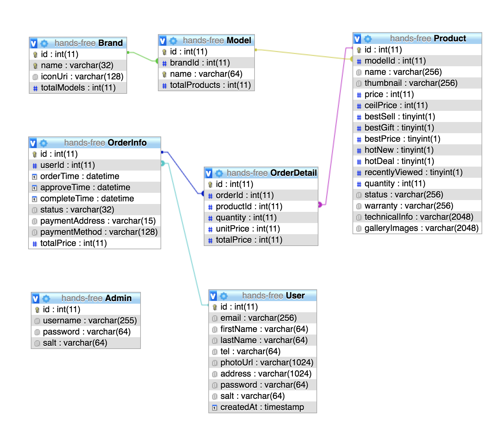

# Hands-free Server
Assignment web (HCMUT) - PHP Server for Hands-free App

Admin page for Hands-free shop (free host): http://admin.hands-free.epizy.com/

Client page for Hands-free shop (free host): http://hands-free.epizy.com/

Apache Server API endpoint (Deploy on AWS EC2 with XAMPP): http://api.hands-free.tk/handsfree

Client Repository: https://github.com/huynhsamha/hands-free-client

Server Repository: https://github.com/huynhsamha/hands-free-server

Admin Page Repository: https://github.com/DarrenNguyen159/hands-free-admin

## Keywords

+ Server on AWS EC2, running Nginx as reverse proxy server for Apache.
+ Install XAMPP for Apache, PHP, MariaDB (MySQL).
+ Web server with RESTful APIs implemented by PHP.
+ JSON Web Token (JWT) for authentication.
+ Using scripts NodeJS for crawler database and generate data set.
+ Feature: 
    + Authentication: Login, Register
    + RESTful APIs: GET, POST
    + Search RESTful: sorting, paging, search keywords,...
    + Upload avatar

## Database



## File structure

## Quickstart

## Config upload avatar

+ View file location:
```php
<?php
echo phpinfo();
?>
```
Search `php.ini` to get location -> open file and search file upload, set ON and set max size of uploaded file

+ Set permission
```bash
# Change owner to nobody
## Temp directory
sudo chown nobody /opt/lampp/temp
## Real directory
sudo chown nobody /opt/lampp/hands-free/uploads

# Add permission for writing to dir
sudo chmod 777 /opt/lampp/hands-free/uploads
```